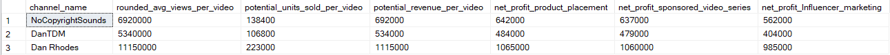
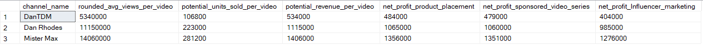
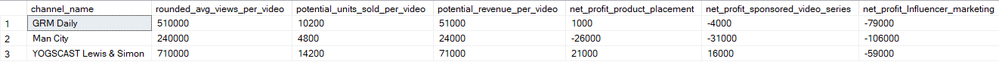

# Data Profolio

# Table of Contents
- [Obejective](#Obejective)
  - [User Story](#User-Story)
- [Data Source](#Data-Source)
- [Stages](#Stages)
  - [Design](#Design)
    - [Dashboard requirements](#Dashboard-requirements)
    - [Tools](#Tools)
  - [Development](#Development)
    - [Pseudocode](#Pseudocode)
    - [Data Exploring](#Data-Exploring)
    - [Data Cleaning](#Data-Cleaning)
  - [Testing](#Testing)
  - [Visualisation](#Visualisation)
  - [Analysis](#Analysis)

# Objective
The Head of Marketing wants to discover the top performing UK Youtubers to form marketing collaborations with throughout the year 2024. 
The goal is to create a dashbaord that provides insights into the top UK YouTubers in 2024 that includes
  * subscriber count
  * total views
  * total videos, and
  * engagement metrics
Recommend YouTube channels best suited for different campaigns types (e.g. product placement, sponsored video series, influencer marketing) by clearly explain it with data-driven justifications

## User Story
As the Head of Marketing, I need a comprehensive dashboard to analyze YouTube channel data in the UK.
This dashboard should enable me to easily identify top-performing channels based on key metrics such as subscriber count, total views, and average video performance.
With these insights, I can make data-driven decisions on selecting the most suitable YouTubers for collaboration, ensuring optimal reach and effectiveness for each marketing campaign.

# Data Source
The data is sourced from Kaggle (an Excel extract).[Here is the link]([https://github.com/your-repo-link](https://www.kaggle.com/datasets/bhavyadhingra00020/top-100-social-media-influencers-2024-countrywise?resource=download))
The data is Top 100 Social Media Influencers 2024 Countrywise and only united-kingdom is taken. 
In the file there are 4 key columns for this project.
  * channel names
  * total subscribers
  * total views
  * total videos uploaded

# Stages
  * Design
  * Development
  * Testing
  * Analysis

## Design
### Dashboard requirements
Here are a few key quesitons that the dashboard should answer:
  * Who are the top 10 YouTubers with the most subscribers?
  * Which 3 channels have uploaded the most videos?
  * Which 3 channels have the most views?
  * Which 3 channels have the highest average views per video?
  * Which 3 channels have the highest views per subscriber ratio?
  * Which 3 channels have the highest subscriber engagement rate per video uploaded?
These questions are subject to be changed as the analysis progresses.

### Tools
| Tools | Purpose |
| --- | --- |
| Excel | Exploring the data |
| SQL Server | Cleaning, testing, and analysing data |
| Power BI | Visualising the data in an interactive dashboard |
| GitHub | Hosting the project documentation and version control |

## Development
### Pseudocode
1. Get the data from Kaggle (Download)
2. Explore the data in Excel, checking columns names, data consistency, and data features etc.
3. Create a Database on SQL Server and load the data into SQL Server
4. Clean the data with SQL, keep the key columns, and create customed columns for the dashboard
5. Test the data with SQL, including column&row count, data type check, and duplication check.
6. Create a view in SQL Server after testing
7. Load the view fomr SQL Server on Power BI and visualize the data in Power BI
8. Generate the findings based on the insights
9. Write the documentation + commentary
10. Publish the data to GitHub Pages

### Data Exploring
1. The data contains 4 key columns for all the analysis and visualisation. We don't need any extra data from other stakeholders.
2. The first column contains the channel ID + channel IDS, which are separated by a '@' symbol, which channel IDS needs to be extracted from.
3. Some of the cells and header names are in a different language or are garbled characters. It doesn't appear to impact on what we need.
4. The data have extra columns that are irelevent to this project.

### Data Cleaning 
Below is a table outlining the constraints on our cleaned dataset:

| Property | Description |
| --- | --- |
| Number of Rows | 100 |
| Number of Columns | 4 |

And here is a tabular representation of the expected schema for the clean data:

| Column Name | Data Type | Nullable |
| --- | --- | --- |
| channel_name | VARCHAR | NO |
| total_subscribers | INTEGER | NO |
| total_views | INTEGER | NO |
| total_videos | INTEGER | NO |

Also there are few steps needed:
1. Remove unnecessary columns by only selecting the ones you need
2. Extract Youtube channel names from the first column
3. Rename columns using aliases

```sql
/*
# 1. Select the required columns
# 2. Extract the channel name from the 'NOMBRE' column
*/

-- 1.
SELECT
    SUBSTRING(NOMBRE, 1, CHARINDEX('@', NOMBRE) -1) AS channel_name,  -- 2. & 3.
    total_subscribers,
    total_views,
    total_videos

FROM
    top_uk_youtubers_2024
```
#### Output


### Create the SQL view 

```sql
/*
# 1. Create a view to store the transformed data
# 2. Cast the extracted channel name as VARCHAR(100)
# 3. Select the required columns from the top_uk_youtubers_2024 SQL table 
*/

-- 1.
CREATE VIEW view_uk_youtubers_2024 AS

-- 2.
SELECT
    CAST(SUBSTRING(NOMBRE, 1, CHARINDEX('@', NOMBRE) -1) AS VARCHAR(100)) AS channel_name, -- 2. 
    total_subscribers,
    total_views,
    total_videos

-- 3.
FROM
    top_uk_youtubers_2024

```


## Testing
4 testings are conducted before the data is loaded to Power BI.

### Row Count Check
```sql
/*
# Count the total number of records (or rows) are in the SQL view
*/

SELECT
    COUNT(*) AS no_of_rows
FROM
    view_uk_youtubers_2024;

```

#### Output


### Column Count Check
```sql
/*
# Count the total number of columns (or fields) are in the SQL view
*/


SELECT
    COUNT(*) AS column_count
FROM
    INFORMATION_SCHEMA.COLUMNS
WHERE
    TABLE_NAME = 'view_uk_youtubers_2024'
```

#### Output


### Data Type Check
```sql
/*
# Check the data types of each column from the view by checking the INFORMATION SCHEMA view
*/

-- 1.
SELECT
    COLUMN_NAME,
    DATA_TYPE
FROM
    INFORMATION_SCHEMA.COLUMNS
WHERE
    TABLE_NAME = 'view_uk_youtubers_2024';
```
#### Output

Column total_views should be integer


### Duplicate Check
```sql
/*
# 1. Check for duplicate rows in the view
# 2. Group by the channel name
# 3. Filter for groups with more than one row
*/

-- 1.
SELECT
    channel_name,
    COUNT(*) AS duplicate_count
FROM
    view_uk_youtubers_2024

-- 2.
GROUP BY
    channel_name

-- 3.
HAVING
    COUNT(*) > 1;
```
#### Output


### Create the revised SQL view 

```sql
/*
# 1. Create a view to store the transformed data
# 2. Cast the extracted channel name as VARCHAR(100)
# 3. Select the required columns from the top_uk_youtubers_2024 SQL table 
*/

-- 1.
CREATE VIEW revised_view_uk_youtubers_2024 AS

-- 2.
SELECT
    CAST(SUBSTRING(NOMBRE, 1, CHARINDEX('@', NOMBRE) -1) AS VARCHAR(100)) AS channel_name, -- 2. 
    total_subscribers,
    CAST(total_views AS bigint) AS total_views,
    total_videos

-- 3.
FROM
    top_uk_youtubers_2024

```
### Second Data Type Check

```sql
/*
# Check the data types of each column from the view by checking the INFORMATION SCHEMA view
*/

-- 1.
SELECT
    COLUMN_NAME,
    DATA_TYPE
FROM
    INFORMATION_SCHEMA.COLUMNS
WHERE
    TABLE_NAME = 'view_uk_youtubers_2024';
```
#### Output


## Visualisation

### Result

Interactive Dashboard on Power BI, which shows Top YouTubers in the UK 2024.


### DAX Measures

#### 1. Total Subscribers (M)
```dax
Total Subscribers (M) = 
VAR million = 1000000
VAR sumOfSubscribers = SUM(view_uk_youtubers_2024[total_subscribers])
VAR totalSubscribers = DIVIDE(sumOfSubscribers,million)

RETURN totalSubscribers

```

#### 2. Total Views (B)
```dax
Total Views (B) = 
VAR billion = 1000000000
VAR sumOfTotalViews = SUM(view_uk_youtubers_2024[total_views])
VAR totalViews = ROUND(sumOfTotalViews / billion, 2)

RETURN totalViews

```

#### 3. Total Videos
```dax
Total Videos = 
VAR totalVideos = SUM(view_uk_youtubers_2024[total_videos])

RETURN totalVideos

```

#### 4. Average Views Per Video (M)
```dax
Average Views per Video (M) = 
VAR sumOfTotalViews = SUM(view_uk_youtubers_2024[total_views])
VAR sumOfTotalVideos = SUM(view_uk_youtubers_2024[total_videos])
VAR  avgViewsPerVideo = DIVIDE(sumOfTotalViews,sumOfTotalVideos, BLANK())
VAR finalAvgViewsPerVideo = DIVIDE(avgViewsPerVideo, 1000000, BLANK())

RETURN finalAvgViewsPerVideo 

```


#### 5. Subscriber Engagement Rate
```dax
Subscriber Engagement Rate = 
VAR sumOfTotalSubscribers = SUM(view_uk_youtubers_2024[total_subscribers])
VAR sumOfTotalVideos = SUM(view_uk_youtubers_2024[total_videos])
VAR subscriberEngRate = DIVIDE(sumOfTotalSubscribers, sumOfTotalVideos, BLANK())

RETURN subscriberEngRate 

```


#### 6. Views per subscriber
```dax
Views Per Subscriber = 
VAR sumOfTotalViews = SUM(view_uk_youtubers_2024[total_views])
VAR sumOfTotalSubscribers = SUM(view_uk_youtubers_2024[total_subscribers])
VAR viewsPerSubscriber = DIVIDE(sumOfTotalViews, sumOfTotalSubscribers, BLANK())

RETURN viewsPerSubscriber 

```
# Analysis

To start with, we will answer the questions from internal customer

## Questions Answered

### 1. Who are the top 10 YouTubers with the most subscribers?

| Rank | Channel Name         | Subscribers (M) |
|------|----------------------|-----------------|
| 1    | NoCopyrightSounds    | 33.60           |
| 2    | DanTDM               | 28.60           |
| 3    | Dan Rhodes           | 26.50           |
| 4    | Miss Katy            | 24.50           |
| 5    | Mister Max           | 24.40           |
| 6    | KSI                  | 24.10           |
| 7    | Jelly                | 23.50           |
| 8    | Dua Lipa             | 23.30           |
| 9    | Sidemen              | 21.00           |
| 10   | Ali-A                | 18.90           |


### 2. Which 3 channels have uploaded the most videos?

| Rank | Channel Name    | Videos Uploaded |
|------|-----------------|-----------------|
| 1    | GRM Daily       | 14,696          |
| 2    | Manchester City | 8,248           |
| 3    | Yogscast        | 6,435           |


### 3. Which 3 channels have the most views?


| Rank | Channel Name | Total Views (B) |
|------|--------------|-----------------|
| 1    | DanTDM       | 19.78           |
| 2    | Dan Rhodes   | 18.56           |
| 3    | Mister Max   | 15.97           |


### 4. Which 3 channels have the highest average views per video?

| Channel Name | Averge Views per Video (M) |
|--------------|-----------------|
| Mark Ronson  | 32.27           |
| Jessie J     | 5.97            |
| Dua Lipa     | 5.76            |


### 5. Which 3 channels have the highest views per subscriber ratio?

| Rank | Channel Name       | Views per Subscriber        |
|------|-----------------   |---------------------------- |
| 1    | GRM Daily          | 1185.79                     |
| 2    | Nickelodeon        | 1061.04                     |
| 3    | Disney Junior UK   | 1031.97                     |


### 6. Which 3 channels have the highest subscriber engagement rate per video uploaded?

| Rank | Channel Name    | Subscriber Engagement Rate  |
|------|-----------------|---------------------------- |
| 1    | Mark Ronson     | 343,000                     |
| 2    | Jessie J        | 110,416.67                  |
| 3    | Dua Lipa        | 104,954.95                  |


## Key feature Analysis

Below are the key features that determine top Youtuber in the UK. They are important in generating ROI for the internal customer. For the top 3 YouTuber of the each key feasure we will calculate the ROI of product placement, sponsored video series, and Influencer marketing.
- subscribers
- total views
- videos uploaded

### Assumption

To calculate expected profit, we need to make the below assumptions.

- The Product cost is at $5
- The conversion rate is assumed to be 2% across all channels. (In practice, historical data for each channel can be analyzed to identify trends and provide more accurate projections for conversion rates.)
- The one-time campaign cost is set at $50,000 (Product Placement), 3-month contract at $130,000 (Influencer marketing) or 1 video costs $5,000 (sponsored video series) for all channels. (In reality, each YouTuber may have a different quote for the campaign. To refine the analysis, specific quotes would be required from individual YouTubers.)

### 1. Youtubers with the most subscribers 


```sql
/* 

# 1. Define variables 
# 2. Create a CTE that rounds the average views per video 
# 3. Select the column you need and create calculated columns from existing ones 
# 4. Filter results by Youtube channels
# 5. Sort results by net profits (from highest to lowest)

*/


-- 1. 
DECLARE @conversionRate FLOAT = 0.02;		-- The conversion rate @ 2%
DECLARE @productCost MONEY = 5.0;		-- The product cost @ $5
DECLARE @campaignCost MONEY = 50000.0;		-- The campaign cost @ $50,000	
DECLARE @numberOfVideos INT = 11;               -- The number of videos (11)
DECLARE @campaignCostPerVideo FLOAT = 5000.0;   -- The campaign cost per video @ $5,000
DECLARE @campaignCostM MONEY = 130000.0;	-- The campaign cost @ $130,000

-- 2.  
WITH ChannelData AS (
    SELECT 
        channel_name,
		total_subscribers,
        total_views,
        total_videos,
        ROUND((CAST(total_views AS FLOAT) / total_videos), -4) AS rounded_avg_views_per_video
    FROM 
        youtube_db.dbo.view_uk_youtubers_2024
)
-- 3.
SELECT TOP 3
    channel_name,
    rounded_avg_views_per_video,
    (rounded_avg_views_per_video * @conversionRate) AS potential_units_sold_per_video,
    (rounded_avg_views_per_video * @conversionRate * @productCost) AS potential_revenue_per_video,
    (rounded_avg_views_per_video * @conversionRate * @productCost) - @campaignCost)AS net_profit_product_placement,
    (rounded_avg_views_per_video * @conversionRate * @productCost) - (@campaignCostPerVideo * @numberOfVideos) AS net_profit_sponsored_video_series,
    (rounded_avg_views_per_video * @conversionRate * @productCost) - @campaignCostM AS net_profit_Influencer_marketing
    
FROM 
    ChannelData

-- 4. 
-- 5.  
ORDER BY
	total_subscribers DESC
```
#### Output


### 2. Youtubers with the most total views

```sql
/* 

# 1. Define variables 
# 2. Create a CTE that rounds the average views per video 
# 3. Select the column you need and create calculated columns from existing ones 
# 4. Filter results by Youtube channels
# 5. Sort results by net profits (from highest to lowest)

*/


-- 1. 
DECLARE @conversionRate FLOAT = 0.02;		-- The conversion rate @ 2%
DECLARE @productCost MONEY = 5.0;		-- The product cost @ $5
DECLARE @campaignCost MONEY = 50000.0;		-- The campaign cost @ $50,000	
DECLARE @numberOfVideos INT = 11;               -- The number of videos (11)
DECLARE @campaignCostPerVideo FLOAT = 5000.0;   -- The campaign cost per video @ $5,000
DECLARE @campaignCostM MONEY = 130000.0;	-- The campaign cost @ $130,000

-- 2.  
WITH ChannelData AS (
    SELECT 
        channel_name,
		total_subscribers,
        total_views,
        total_videos,
        ROUND((CAST(total_views AS FLOAT) / total_videos), -4) AS rounded_avg_views_per_video
    FROM 
        youtube_db.dbo.view_uk_youtubers_2024
)
-- 3.
SELECT TOP 3
    channel_name,
    rounded_avg_views_per_video,
    (rounded_avg_views_per_video * @conversionRate) AS potential_units_sold_per_video,
    (rounded_avg_views_per_video * @conversionRate * @productCost) AS potential_revenue_per_video,
    (rounded_avg_views_per_video * @conversionRate * @productCost - @campaignCost)AS net_profit_product_placement,
    (rounded_avg_views_per_video * @conversionRate * @productCost) - (@campaignCostPerVideo * @numberOfVideos) AS net_profit_sponsored_video_series,
    (rounded_avg_views_per_video * @conversionRate * @productCost) - @campaignCostM AS net_profit_Influencer_marketing
    
FROM 
    ChannelData

-- 4. 
-- 5.  
ORDER BY
	total_views DESC
```
#### Output



### 3. Youtubers with the most videos uploaded

The Top 5 most videos uploaded are media (e.g. BBC News) which are not the potential partners.
Therefore we skip first 5 rows and take top 6-8 instead.

```sql
/* 

# 1. Define variables 
# 2. Create a CTE that rounds the average views per video 
# 3. Select the column you need and create calculated columns from existing ones 
# 4. Filter results by Youtube channels
# 5. Sort results by net profits (from highest to lowest)

*/


-- 1. 
DECLARE @conversionRate FLOAT = 0.02;		-- The conversion rate @ 2%
DECLARE @productCost MONEY = 5.0;		-- The product cost @ $5
DECLARE @campaignCost MONEY = 50000.0;		-- The campaign cost @ $50,000	
DECLARE @numberOfVideos INT = 11;               -- The number of videos (11)
DECLARE @campaignCostPerVideo FLOAT = 5000.0;   -- The campaign cost per video @ $5,000
DECLARE @campaignCostM MONEY = 130000.0;	-- The campaign cost @ $130,000

-- 2.  
WITH ChannelData AS (
    SELECT 
        channel_name,
		total_subscribers,
        total_views,
        total_videos,
        ROUND((CAST(total_views AS FLOAT) / total_videos), -4) AS rounded_avg_views_per_video
    FROM 
        youtube_db.dbo.view_uk_youtubers_2024
)
-- 3.
SELECT
    channel_name,
    rounded_avg_views_per_video,
    (rounded_avg_views_per_video * @conversionRate) AS potential_units_sold_per_video,
    (rounded_avg_views_per_video * @conversionRate * @productCost) AS potential_revenue_per_video,
    (rounded_avg_views_per_video * @conversionRate * @productCost - @campaignCost)AS net_profit_product_placement,
    (rounded_avg_views_per_video * @conversionRate * @productCost) - (@campaignCostPerVideo * @numberOfVideos) AS net_profit_sponsored_video_series,
    (rounded_avg_views_per_video * @conversionRate * @productCost) - @campaignCostM AS net_profit_Influencer_marketing
    
FROM 
    ChannelData

-- 4. 
-- 5.  
ORDER BY
	total_videos DESC
OFFSET 5 ROWS FETCH NEXT 3 ROWS ONLY
```
#### Output



## Findings

1. NoCopyrightSOunds, Dan Rhodes and DanTDM are the channnels with the most subscribers in the UK
2. GRM Daily, Man City and Yogscast are the channels with the most videos uploaded
3. News Channels are with the most views. If we ignore them, DanTDM, Dan Rhodes and Mister Max are the channels with the most views 
4. Entertainment channels are valuable for achieving broader reach, as they consistently post content and typically generate the highest engagement. These channels, especially those focused on entertainment and music, tend to have large, active audiences, making them ideal for maximizing visibility and brand exposure.

## Recommendations 
 
1. Dan Rhodes is an ideal collaborator for maximizing visibility, with the largest UK subscriber base (27.1 million) and over 19 billion total views. His highly engaged audience makes him a top choice for impactful campaigns.
2. While GRM Daily, Man City, and Yogscast are top UK publishers, collaborating with them may not be cost-effective given budget constraints, as their potential ROI is lower compared to other channels with higher engagement like DanTDM and Dan Rhodes.
3. Mister Max is excellent for immediate reach, offering the highest ROI across various marketing campaigns.
4. While DanTDM has a lower ROI compared to Dan Rhodes, it remains a viable partnership option due to its stable viewership and consistent subscriber base, offering potential for long-term growth.


### Potential ROI 

1. A collaboration deal with Dan Rhodes is projected to yield a net profit of $1,065,000 per video.
2. Partnering with Mister Max could generate:
   - $1,356,000 from product placements,
   - $1,351,000 from a sponsored video series, and
   - $1,276,000 from influencer marketing campaigns.
3. A product placement campaign with DanTDM is estimated to bring in $484,000 per video, while an influencer marketing deal could result in a one-time net profit of $404,000.
4. Collaborating with NoCopyrightSounds could yield a profit of $642,000 per video. However, further investigation is needed as it is not a typical channel.

### Action plan

Based on our analysis, we recommend pursuing a long-term partnership with Dan Rhodes as the top choice for promoting the client's products.

We will first engage with the marketing client to align on expectations for this collaboration. If we achieve the desired milestones, we will then explore potential partnerships with DanTDM, Mister Max, and NoCopyrightSounds in the future.

### Action Plan:
1. **Initiate Contact**: Reach out to the teams behind each channel, starting with Dan Rhodes. If capacity allows, initiate discussions with Mister Max for a potential short-term collaboration.
2. **Negotiate Contracts**: Finalize agreements within the allocated marketing campaign budgets.
3. **Launch Campaigns**: Execute the campaigns and monitor performance against defined KPIs.
4. **Analyze Results**: Evaluate campaign outcomes, gather insights, and optimize strategies based on customer feedback and audience engagement.


