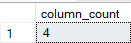

# Data Profolio

# Table of Contents
- [Obejective](#Obejective)
  - [User Story](#User-Story)
- [Data Source](#Data-Source)
- [Stages](#Stages)
  - [Design](#Design)
    - [Dashboard requirements](#Dashboard-requirements)
    - [Tools](#Tools)
  - [Development](#Development)
    - [Pseudocode](#Pseudocode)
    - [Data Exploring](#Data-Exploring)
    - [Data Cleaning](#Data-Cleaning)
  - [Testing](#Testing)
  - [Visualisation](#Visualisation)
  - [Analysis](#Analysis)

# Objective
The Head of Marketing wants to discover the top performing UK Youtubers to form marketing collaborations with throughout the year 2024. 
The goal is to create a dashbaord that provides insights into the top UK YouTubers in 2024 that includes
  * subscriber count
  * total views
  * total videos, and
  * engagement metrics
Recommend YouTube channels best suited for different campaigns types (e.g. product placement, sponsored video series, influencer marketing) by clearly explain it with data-driven justifications

## User Story
As the Head of Marketing, I need a comprehensive dashboard to analyze YouTube channel data in the UK.
This dashboard should enable me to easily identify top-performing channels based on key metrics such as subscriber count, total views, and average video performance.
With these insights, I can make data-driven decisions on selecting the most suitable YouTubers for collaboration, ensuring optimal reach and effectiveness for each marketing campaign.

# Data Source
The data is sourced from Kaggle (an Excel extract).[Here is the link]([https://github.com/your-repo-link](https://www.kaggle.com/datasets/bhavyadhingra00020/top-100-social-media-influencers-2024-countrywise?resource=download))
The data is Top 100 Social Media Influencers 2024 Countrywise and only united-kingdom is taken. 
In the file there are 4 key columns for this project.
  * channel names
  * total subscribers
  * total views
  * total videos uploaded

# Stages
  * Design
  * Development
  * Testing
  * Analysis

## Design
### Dashboard requirements
Here are a few key quesitons that the dashboard should answer:
  * Who are the top 10 YouTubers with the most subscribers?
  * Which 3 channels have uploaded the most videos?
  * Which 3 channels have the most views?
  * Which 3 channels have the highest average views per video?
  * Which 3 channels have the highest views per subscriber ratio?
  * Which 3 channels have the highest subscriber engagement rate per video uploaded?
These questions are subject to be changed as the analysis progresses.

### Tools
| Tools | Purpose |
| --- | --- |
| Excel | Exploring the data |
| SQL Server | Cleaning, testing, and analysing data |
| Power BI | Visualising the data in an interactive dashboard |
| GitHub | Hosting the project documentation and version control |

## Development
### Pseudocode
1. Get the data from Kaggle (Download)
2. Explore the data in Excel, checking columns names, data consistency, and data features etc.
3. Create a Database on SQL Server and load the data into SQL Server
4. Clean the data with SQL, keep the key columns, and create customed columns for the dashboard
5. Test the data with SQL, including column&row count, data type check, and duplication check.
6. Create a view in SQL Server after testing
7. Load the view fomr SQL Server on Power BI and visualize the data in Power BI
8. Generate the findings based on the insights
9. Write the documentation + commentary
10. Publish the data to GitHub Pages

### Data Exploring
1. The data contains 4 key columns for all the analysis and visualisation. We don't need any extra data from other stakeholders.
2. The first column contains the channel ID + channel IDS, which are separated by a '@' symbol, which channel IDS needs to be extracted from.
3. Some of the cells and header names are in a different language or are garbled characters. It doesn't appear to impact on what we need.
4. The data have extra columns that are irelevent to this project.

### Data Cleaning 
Below is a table outlining the constraints on our cleaned dataset:

| Property | Description |
| --- | --- |
| Number of Rows | 100 |
| Number of Columns | 4 |

And here is a tabular representation of the expected schema for the clean data:

| Column Name | Data Type | Nullable |
| --- | --- | --- |
| channel_name | VARCHAR | NO |
| total_subscribers | INTEGER | NO |
| total_views | INTEGER | NO |
| total_videos | INTEGER | NO |

Also there are few steps needed:
1. Remove unnecessary columns by only selecting the ones you need
2. Extract Youtube channel names from the first column
3. Rename columns using aliases

```sql
/*
# 1. Select the required columns
# 2. Extract the channel name from the 'NOMBRE' column
*/

-- 1.
SELECT
    SUBSTRING(NOMBRE, 1, CHARINDEX('@', NOMBRE) -1) AS channel_name,  -- 2. & 3.
    total_subscribers,
    total_views,
    total_videos

FROM
    top_uk_youtubers_2024
```
#### Output


### Create the SQL view 

```sql
/*
# 1. Create a view to store the transformed data
# 2. Cast the extracted channel name as VARCHAR(100)
# 3. Select the required columns from the top_uk_youtubers_2024 SQL table 
*/

-- 1.
CREATE VIEW view_uk_youtubers_2024 AS

-- 2.
SELECT
    CAST(SUBSTRING(NOMBRE, 1, CHARINDEX('@', NOMBRE) -1) AS VARCHAR(100)) AS channel_name, -- 2. 
    total_subscribers,
    total_views,
    total_videos

-- 3.
FROM
    top_uk_youtubers_2024

```


## Testing
4 testings are conducted before the data is loaded to Power BI.

### Row Count Check
```sql
/*
# Count the total number of records (or rows) are in the SQL view
*/

SELECT
    COUNT(*) AS no_of_rows
FROM
    view_uk_youtubers_2024;

```

#### Output


### Column Count Check
```sql
/*
# Count the total number of columns (or fields) are in the SQL view
*/


SELECT
    COUNT(*) AS column_count
FROM
    INFORMATION_SCHEMA.COLUMNS
WHERE
    TABLE_NAME = 'view_uk_youtubers_2024'
```

#### Output



### Data Type Check
```sql
/*
# Check the data types of each column from the view by checking the INFORMATION SCHEMA view
*/

-- 1.
SELECT
    COLUMN_NAME,
    DATA_TYPE
FROM
    INFORMATION_SCHEMA.COLUMNS
WHERE
    TABLE_NAME = 'view_uk_youtubers_2024';
```
#### Output

Column total_views should be integer


### Duplicate Check
```sql
/*
# 1. Check for duplicate rows in the view
# 2. Group by the channel name
# 3. Filter for groups with more than one row
*/

-- 1.
SELECT
    channel_name,
    COUNT(*) AS duplicate_count
FROM
    view_uk_youtubers_2024

-- 2.
GROUP BY
    channel_name

-- 3.
HAVING
    COUNT(*) > 1;
```
#### Output


### Create the revised SQL view 

```sql
/*
# 1. Create a view to store the transformed data
# 2. Cast the extracted channel name as VARCHAR(100)
# 3. Select the required columns from the top_uk_youtubers_2024 SQL table 
*/

-- 1.
CREATE VIEW revised_view_uk_youtubers_2024 AS

-- 2.
SELECT
    CAST(SUBSTRING(NOMBRE, 1, CHARINDEX('@', NOMBRE) -1) AS VARCHAR(100)) AS channel_name, -- 2. 
    total_subscribers,
    CAST(total_views AS bigint) AS total_views,
    total_videos

-- 3.
FROM
    top_uk_youtubers_2024

```
### Second Data Type Check

```sql
/*
# Check the data types of each column from the view by checking the INFORMATION SCHEMA view
*/

-- 1.
SELECT
    COLUMN_NAME,
    DATA_TYPE
FROM
    INFORMATION_SCHEMA.COLUMNS
WHERE
    TABLE_NAME = 'view_uk_youtubers_2024';
```
#### Output


## Visualisation

### Result

Interactive Dashboard on Power BI, which shows Top YouTubers in the UK 2024.


### DAX Measures

#### 1. Total Subscribers (M)
```dax
Total Subscribers (M) = 
VAR million = 1000000
VAR sumOfSubscribers = SUM(view_uk_youtubers_2024[total_subscribers])
VAR totalSubscribers = DIVIDE(sumOfSubscribers,million)

RETURN totalSubscribers

```

#### 2. Total Views (B)
```dax
Total Views (B) = 
VAR billion = 1000000000
VAR sumOfTotalViews = SUM(view_uk_youtubers_2024[total_views])
VAR totalViews = ROUND(sumOfTotalViews / billion, 2)

RETURN totalViews

```

#### 3. Total Videos
```dax
Total Videos = 
VAR totalVideos = SUM(view_uk_youtubers_2024[total_videos])

RETURN totalVideos

```

#### 4. Average Views Per Video (M)
```dax
Average Views per Video (M) = 
VAR sumOfTotalViews = SUM(view_uk_youtubers_2024[total_views])
VAR sumOfTotalVideos = SUM(view_uk_youtubers_2024[total_videos])
VAR  avgViewsPerVideo = DIVIDE(sumOfTotalViews,sumOfTotalVideos, BLANK())
VAR finalAvgViewsPerVideo = DIVIDE(avgViewsPerVideo, 1000000, BLANK())

RETURN finalAvgViewsPerVideo 

```


#### 5. Subscriber Engagement Rate
```dax
Subscriber Engagement Rate = 
VAR sumOfTotalSubscribers = SUM(view_uk_youtubers_2024[total_subscribers])
VAR sumOfTotalVideos = SUM(view_uk_youtubers_2024[total_videos])
VAR subscriberEngRate = DIVIDE(sumOfTotalSubscribers, sumOfTotalVideos, BLANK())

RETURN subscriberEngRate 

```


#### 6. Views per subscriber
```dax
Views Per Subscriber = 
VAR sumOfTotalViews = SUM(view_uk_youtubers_2024[total_views])
VAR sumOfTotalSubscribers = SUM(view_uk_youtubers_2024[total_subscribers])
VAR viewsPerSubscriber = DIVIDE(sumOfTotalViews, sumOfTotalSubscribers, BLANK())

RETURN viewsPerSubscriber 

```


